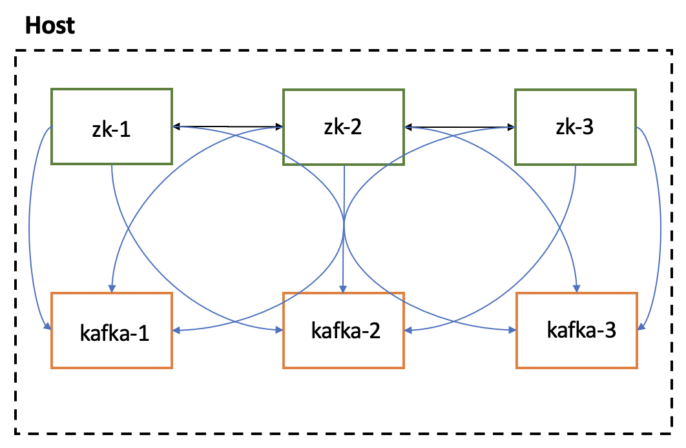

# Containerised Kafka

[Apache Kafka](https://kafka.apache.org) is an open-source distributed event streaming platform used by thousands of companies for high-performance data pipelines, streaming analytics, data integration, and mission-critical applications.

[Apache Zookeeper](https://zookeeper.apache.org/) is a centralized service for maintaining configuration information, naming, providing distributed synchronization, and providing group services. It is an essential part of `Kafka`.

This project provides the means to execute `Kafka` in a distributed architecture with a 3-node [Broker](https://kafka.apache.org/intro#intro_nutshell) cluster. Also, `Zookeeper` is configured in [Replicated mode](https://zookeeper.apache.org/doc/r3.5.4-beta/zookeeperOver.html) - called `ensemble` - to take advantage of distributed architecture.

> The solutions provided were designed for local development. Hence, are not to be treated as production-ready, especially because of the lack of security settings.

## Local Development Environment

In the `docker` folder, it's available the installation and configuration of a [Containerised Kafka](./docker/README.md) environment to run locally.

In the `docker/demo` [folder](./docker/demo/README.md), it's available instructions to demonstrate how `Kafka` preserves message ordering.

## Architecture

