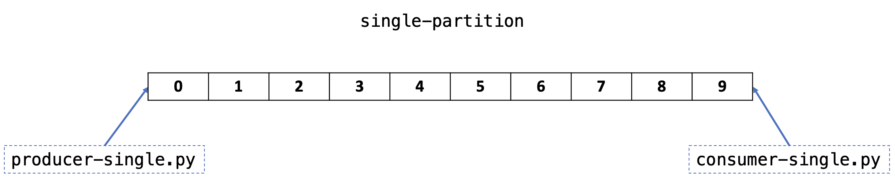
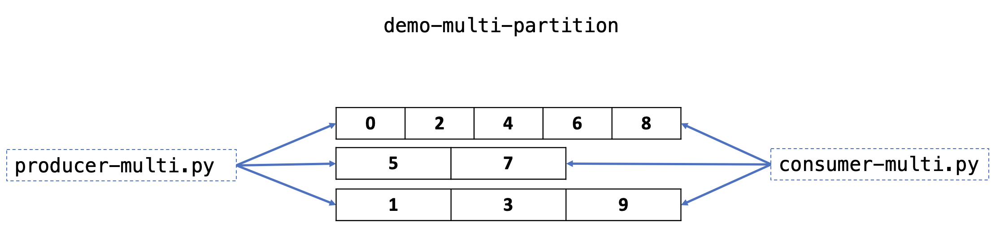
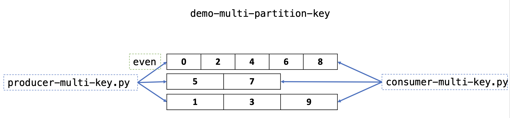

# Preserve Message Ordering

For some use cases, the message order is very important. For example, in financial services, there is a major difference between depositing €100 in an account and later withdrawing it, and the other way around.

At a high-level Kafka gives the following guarantees:

- Messages sent by a producer to a particular topic partition are appended in the order they are sent. For example, if a record M1 is sent by the same producer as a record M2, and M1 is sent first, then M1 will have a lower offset than M2 and appear earlier in the log.
- A consumer instance sees records in the order they are stored in the log.

With these guarantees, a topic with a single partition will maintain the order of the messages as they are produced. However, partitions are important for parallelism and high availability. On the other hand, a topic with multiple partitions will not, by default, have its messages consumed in the same order they were produced.

The scenarios here aim to demonstrate Kafka's behaviour for topics with `single partition`, `multiple partitions`, and `use of keys to maintain order`.

References:
[Kafka Concepts](https://kafka.apache.org/intro#intro_concepts_and_terms)
[Kafka Semantics](https://kafka.apache.org/documentation/#semantics)

## Prerequisities

- [Python 3.8](https://www.python.org/downloads/)
- [Python client for Apache Kafka](https://pypi.org/project/kafka-python/): `pip3 install kafka-python`
- Start the Kafka cluster by initialising the containers defined in the docker compose file available [here](../../build/docker-compose.yml):

```bash
 docker-compose -f ../../build/docker-compose.yml up -d
```

## Single partition



**Producer**:

The `python` script `producer-single.py` will create a topic called `demo-single-partition`, if not exists, and send 10 messages to the topic.

Execute with the following command:

`python3 producer-single.py`

**Consumer**:

The `python` script `consumer-single.py` will read from the topic `demo-single-partition` in the same order the producer inserted the messages.

Execute with the following command:

`python3 consumer-single.py`

**Results**:

```bash
demo-single-partition:0:0: value=b'msg 0'
demo-single-partition:0:1: value=b'msg 1'
demo-single-partition:0:2: value=b'msg 2'
demo-single-partition:0:3: value=b'msg 3'
demo-single-partition:0:4: value=b'msg 4'
demo-single-partition:0:5: value=b'msg 5'
demo-single-partition:0:6: value=b'msg 6'
demo-single-partition:0:7: value=b'msg 7'
demo-single-partition:0:8: value=b'msg 8'
demo-single-partition:0:9: value=b'msg 9'
```

## Multiple partitions



**Producer**:

The `python` script `producer-multi.py` will create a topic called `demo-multi-partition` with 3 partitions, if not exists, and send 10 messages to the topic.

Differently, from the `Single Partition` scenario, here the messages are written in all 3 partitions across the brokers.

Execute with the following command:

`python3 producer-multi.py`

**Consumer**:

The `python` script `consumer-multi.py` will read from the topic `demo-multi-partition` and the order of the data output is not deterministic.

Execute with the following command:

`python3 consumer-multi.py`

**Results**:

```bash
demo-multi-partition:1:0: value=b'msg 2'
demo-multi-partition:1:1: value=b'msg 3'
demo-multi-partition:1:2: value=b'msg 4'
demo-multi-partition:1:3: value=b'msg 9'
demo-multi-partition:2:0: value=b'msg 1'
demo-multi-partition:2:1: value=b'msg 5'
demo-multi-partition:2:2: value=b'msg 6'
demo-multi-partition:0:0: value=b'msg 0'
demo-multi-partition:0:1: value=b'msg 7'
demo-multi-partition:0:2: value=b'msg 8'
```

Important to notice that despite the fact there is no global order, the order is kept within each partition.

## Multiple partitions with key



Events with the same event key (e.g., a customer or vehicle ID) are written to the same partition, and Kafka guarantees that any consumer of a given topic-partition will always read that partition's events in exactly the same order as they were written.

In this scenario the `consumer` is interested only in the `even` numbers that are received in the topic and it needs to preserve the order. So, the `producer` will insert the even numbers with a `key=even`. Using the `key` the even numbers should be recorded in the same partition and in order.

**Producer**:

The `python` script `producer-multi-key.py` will create a topic called `demo-multi-partition-key` with 3 partitions, if not exists, and send 10 messages to the topic.

Execute with the following command:

`python3 producer-multi-key.py`

**Consumer**:

The `python` script `consumer-multi-key.py` will read from the topic `demo-multi-partition-key` and the order of the data output is the same that it's inserted in the topic. The consumer only prints the `even` numbers.

Execute with the following command:

`python3 consumer-multi-key.py`

**Results**:

```bash
demo-multi-partition-key:2:0: key=b'even' value=b'number 0 is even'
demo-multi-partition-key:2:2: key=b'even' value=b'number 2 is even'
demo-multi-partition-key:2:3: key=b'even' value=b'number 4 is even'
demo-multi-partition-key:2:4: key=b'even' value=b'number 6 is even'
demo-multi-partition-key:2:5: key=b'even' value=b'number 8 is even'
```
